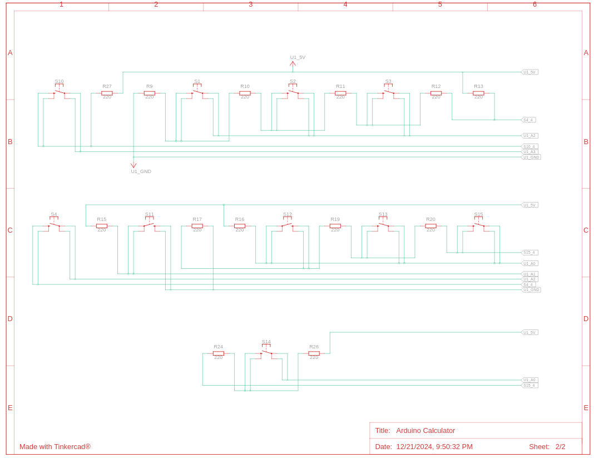

# Arduino Calculator

This is a calculator designed on a breadboard that is controlled by an Arduino. It was made using Tinkercad. You can demo it online with the link below.

The analog button codes may need to manually be adjusted in a real-life version of this circuit.

Link: https://www.tinkercad.com/things/0Eb2vMKnZ9j-arduino-calculator

## Images

### Circuit Layout on the breadboard

  

- **Circuit Layout**: This is the breadboard design showing all the pushbutton and resistor connections, as well as all the input and output connectors for the LCD screen.

*Note: the yellow wires would not be required in an actual build since they are there to ensure all the buttons can fit on the breadboard without Tinkercad's pushbutton size limitations.*

---

### Schematic Diagrams

  
  

- **Schematic Diagram (Page 1)**: The first page of the schematic diagram detailing the connections between the components.
- **Schematic Diagram (Page 2)**: The second page of the schematic diagram showing additional connections.
---

  

- **Circuit Labels**: These are the labels for each pushbutton function on the breadboard.

---

## Components Table

| Name   | Quantity | Component            |
|-----------|----------|----------------------|
| U1        | 1        | LCD 16 x 2           |
| U2        | 1        | Arduino Uno R3       |
| U3        | 1        | LCD 16 x 2           |
| R1-R27    | 21       | 220 Ω Resistor       |
| S1-S15    | 15       | Pushbutton           |

---
